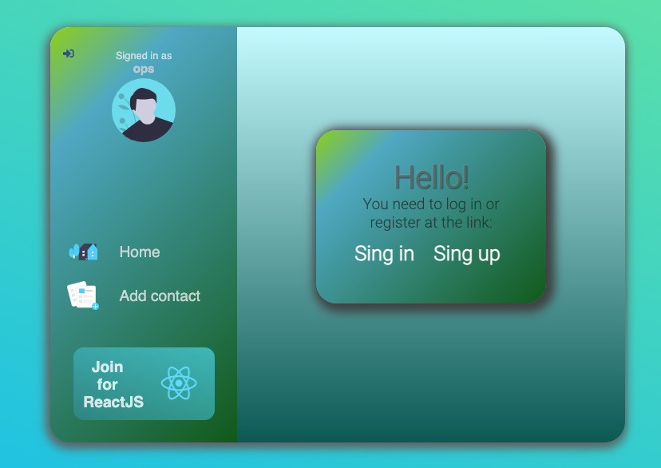
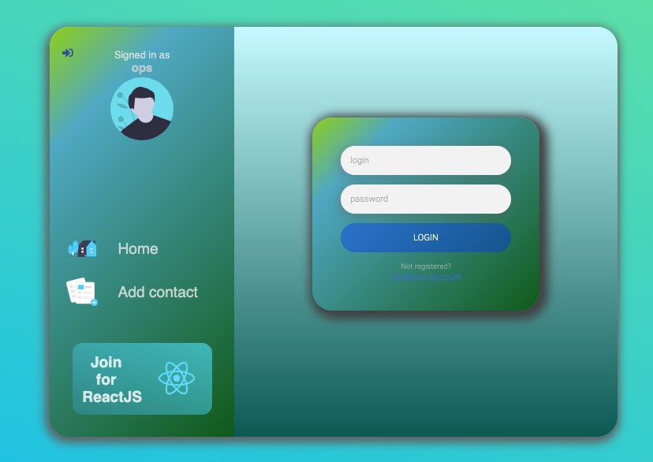
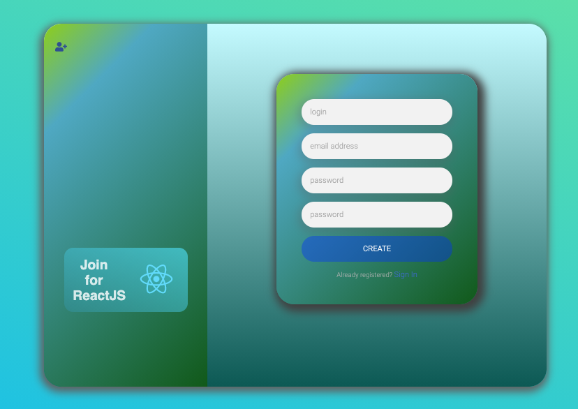
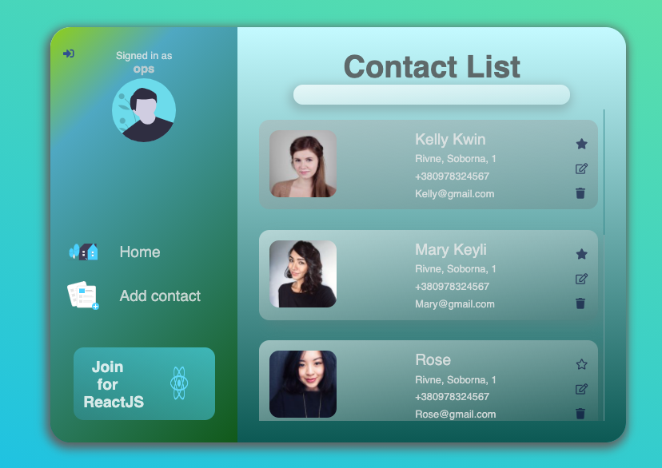
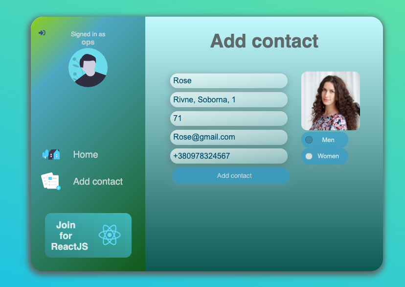

# Contact list(REST API)

pip3 install -r requirements.txt

python3 manage.py runserver

cd frontend:

npm install

npm run dev

📚 
#Stack: 
Django REST framework, ReactJS, ReduxJS/Redux-thunk, JSON Web Token

🖥
#Project description: 
the application is a list of contacts with the ability to register, authorize, add, delete and edit the list, as well as available contact search.

